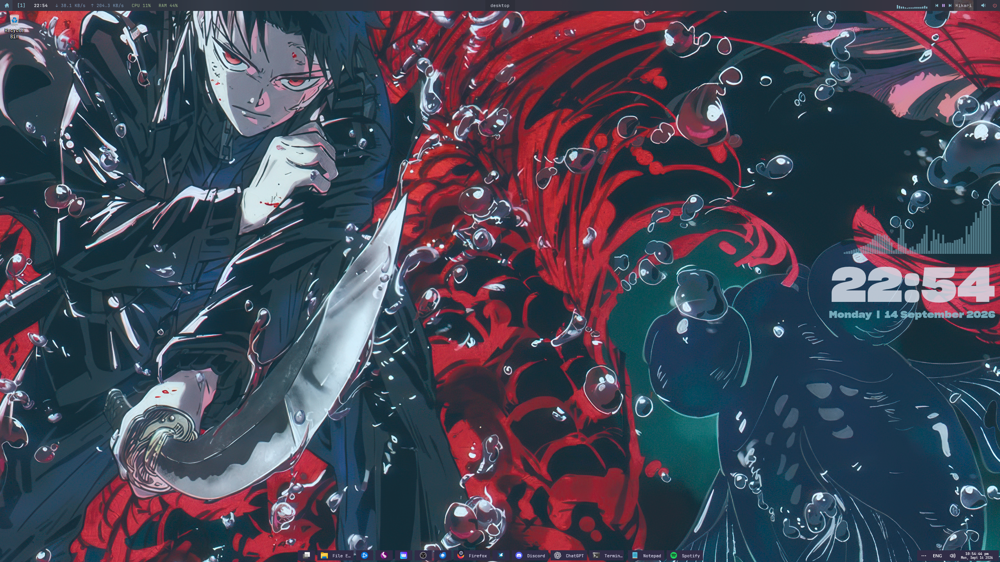
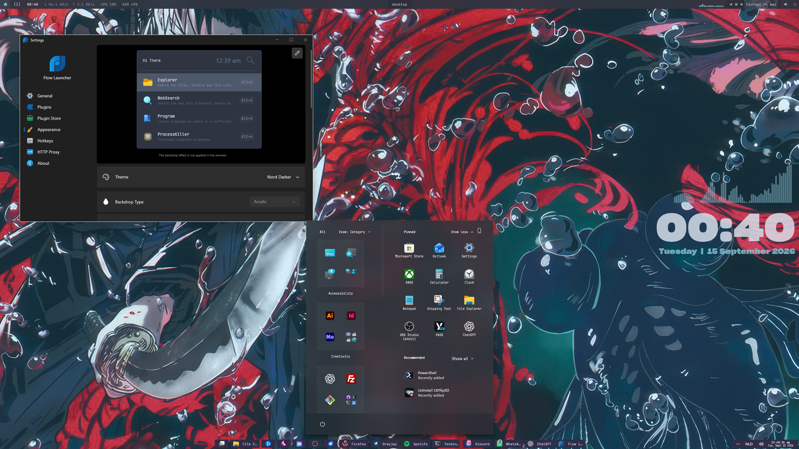
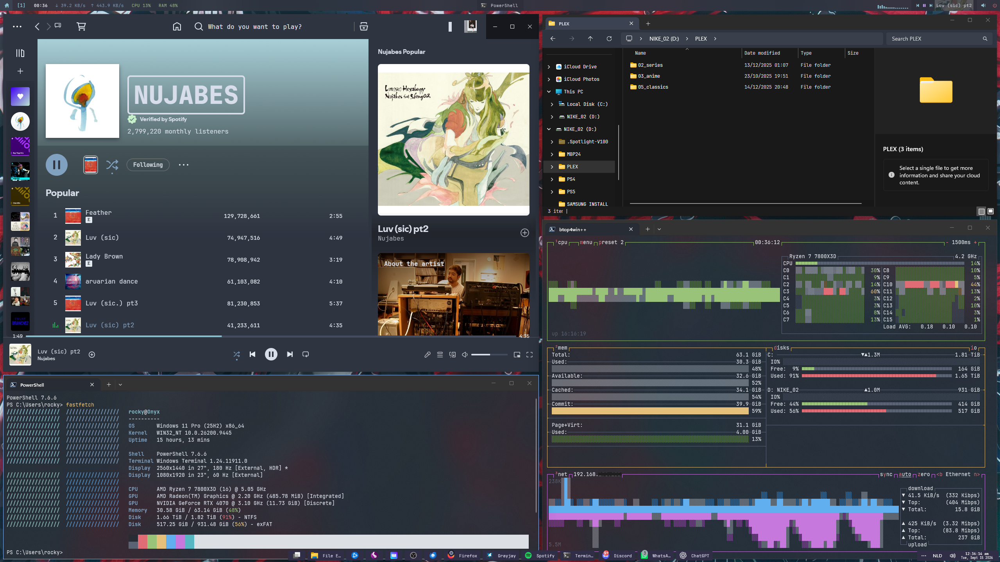
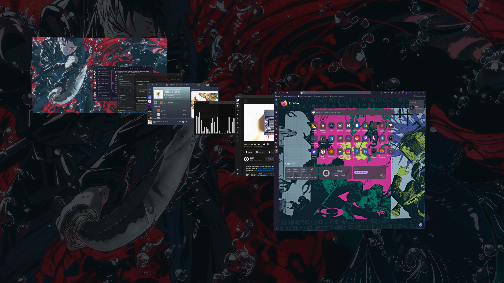
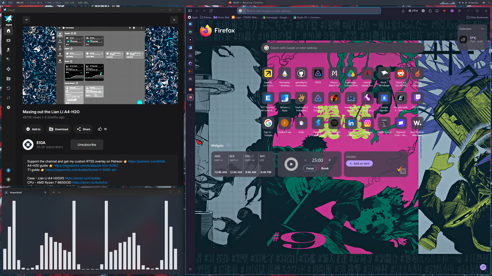

# My first Windows 11 rice

This is my first proper Windows rice.

What started as a small attempt to make Windows feel a bit cleaner and more personal slowly turned into a full desktop setup built around **Nord**, **JetBrains Mono**, sharp corners and a dual-monitor **GlazeWM** workflow.

I'm still learning, so this repo isn't meant to be a definitive Windows customization guide or a one-click installer. It's mostly a snapshot of what I currently use and enjoy.

A lot of the tools, themes and ideas here were made by other people. I mainly combined, configured and adjusted them to fit my own workflow and visual style.



## Screenshots

### Start menu & Flow Launcher



### Daily setup

Spotify, Explorer, btop4win++ and Fastfetch running together.



### Window switching

CKFlip3D in the middle of the workflow.



### App layout

Grayjay, Firefox and the terminal visualizer across the desktop.



## Setup

| Part | What I use |
|---|---|
| Window manager | GlazeWM |
| Top bar | YASB |
| Taskbar | Windhawk |
| Start menu | Windhawk |
| Explorer | Windhawk |
| App launcher | Flow Launcher — Dark Nord |
| Context menu | Nilesoft Shell |
| Window switcher | CKFlip3D |
| Terminal | Windows Terminal + PowerShell 7 |
| System info | Fastfetch |
| System monitor | btop4win++ |
| Desktop clock | Rainmeter — NordClock |
| Desktop visualizer | Rainmeter — Fountain of Colors |
| Top-bar visualizer | Cava through YASB |
| Spotify | Spicetify — Sleek + Nord + my overrides |
| Discord | Vencord + my QuickCSS |
| Main font | JetBrains Mono / JetBrainsMono Nerd Font |
| Wallpapers | Kagurabachi |

## The general idea

I tried to keep the desktop minimal without hiding Windows completely. Most of the setup follows a few simple rules: Nord colors, JetBrains Mono where it makes sense, square or almost-square corners, compact spacing, Frost blue for active states, very few desktop icons and a keyboard-driven workflow.

The main accent is `#88C0D0`.

More details are in [`docs/DESIGN-SYSTEM.md`](docs/DESIGN-SYSTEM.md).

## Dual-monitor layout

- Main display: 2560×1440 landscape
- Secondary display: 1080×1920 portrait
- GlazeWM workspaces 1–5: main display
- GlazeWM workspaces 6–9: portrait display

The portrait monitor is one of the main reasons I ended up using a window manager instead of relying only on Windows snapping.

## Configs in this repo

The `configs/` folder contains copies of the current configuration files I use or, where redistribution would be inappropriate, only my own overrides/notes.

A few things are intentionally **not** included:

- Kagurabachi wallpaper files
- my local Rainmeter audio-device ID
- the full Sleek Spicetify theme
- third-party themes that are already available from their original authors

## GlazeWM

GlazeWM handles most of my window management. I use fairly small gaps and keep the workflow keyboard-driven, while still toggling windows to floating mode when I want a more traditional desktop layout.

A few shortcuts I use a lot:

```text
Alt + 1–9                 Switch workspace
Alt + Shift + 1–9         Move window to workspace and follow it
Alt + H/J/K/L             Focus window
Alt + Shift + H/J/K/L     Move window
Alt + Shift + Space       Toggle floating mode
Alt + V                   Change tiling direction
Alt + R                   Resize mode
Alt + Shift + P           Pause / resume GlazeWM
```

The pause shortcut is especially useful for games or apps that use a lot of Alt-based shortcuts.

## YASB

YASB provides the thin top bar on both displays. The main monitor includes workspaces, clock, network traffic, CPU/RAM, active window, Cava, media, sound and power controls. The portrait display is deliberately simpler.

## Windhawk

Windhawk does most of the Windows-side customization: taskbar styling and labels, taskbar sizing/clock, Start menu styling, Explorer styling/font, window borders and square corners.

The current taskbar started from the **RosePine** preset but is heavily pushed toward the rest of the Nord setup. The Start menu uses **SideBySideMinimal** as a base with Nord colors, square corners and JetBrains Mono overrides.

## Flow Launcher

I use **Dark Nord** as-is. I haven't modified the theme itself, so this repo only documents it rather than redistributing it.

## Nilesoft Shell

Nilesoft Shell handles the context menu. My current version uses a Nord background, JetBrains Mono, square corners, compact spacing and subtle borders. I'm still tweaking some icon behavior.

## Rainmeter

I currently use Rainmeter for two things:

- **NordClock** — large desktop clock/date
- **Fountain of Colors** — the equalizer above the clock

The Fountain of Colors config in this repo has my local audio endpoint removed, because that value is machine-specific.

## Spotify

Spotify uses **Spicetify + Sleek + the Nord color scheme**. I added a small set of overrides for JetBrains Mono, square corners, Nord scrollbars, Frost accents, track selection, artist-title wrapping and progress/volume bars.

I don't redistribute Sleek itself here; only my overrides are included.

## Discord

Discord runs through Vencord with my own QuickCSS. The goal was mostly to make Discord feel like part of the rest of the desktop rather than turning it into something completely different.

It includes a Nord palette, JetBrains Mono, compact channels/chat, square panels, thin scrollbars and Frost selection states.

## Wallpapers

The wallpapers in my current setup are from **Kagurabachi**, mainly sourced from the official Kagurabachi X account and Wallhaven. The image files themselves are not redistributed in this repository.

See [`wallpapers/README.md`](wallpapers/README.md).

## Inspiration

A big visual inspiration was this Nord Windows rice shared on r/desktops:

[Check out this Nord theme guys, I use Windows btw](https://www.reddit.com/r/desktops/comments/1vywd9a/check_out_this_nord_theme_guys_i_use_windows_btw/)

I really liked the overall balance of that setup and used it as a starting point while figuring out what I wanted my own desktop to feel like. Over time it became more tailored to my dual-monitor layout, GlazeWM workflow, Kagurabachi wallpapers and app-specific themes.

## Credits

This setup wouldn't exist without the work of a lot of people in the Windows and desktop-customization communities. Thanks to the developers and creators behind GlazeWM, YASB, Windhawk, Nilesoft Shell, Flow Launcher, Rainmeter, Fountain of Colors, Cava, Fastfetch, btop4win++, Spicetify, Sleek, Vencord, CKFlip3D and JetBrains Mono.

I'm only trying to share my own configs, overrides and notes where appropriate. If I've missed a credit somewhere, please let me know.

More credit notes are in [`docs/CREDITS.md`](docs/CREDITS.md).

## Still tinkering with

- Nilesoft icon behavior
- btop theme polish
- Grayjay theming
- small spacing and typography tweaks

Nothing here is meant to be finished forever. This is just the point where my first rice finally felt complete enough to save.

## Small note

Some of these configs are tied to specific versions of Windows and the tools involved, so updates can break things. If you use anything from here, I'd recommend taking the parts you like rather than trying to reproduce the whole setup exactly.

That is more or less how I ended up with this one too.
